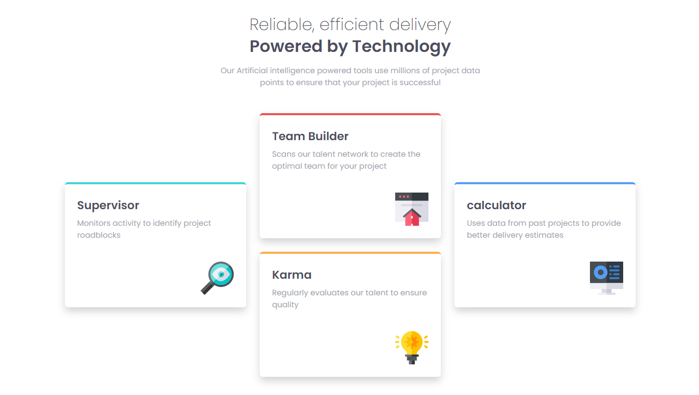

# Frontend Mentor - Four card feature section solution

## Welcome! 👋

Thanks for checking out this front-end coding challenge.

### Screenshot

### Links

- Solution URL: [Add solution URL here](https://your-solution-url.com)
- Live Site URL: [Add live site URL here](https://your-live-site-url.com)

## My process

### Built with

- Semantic HTML5 markup
- CSS custom properties
- Flexbox
- CSS Grid
- Mobile-first workflow

## Author

- Website - [Abhishek N.M](https://product-preview-card-nine-flame.vercel.app/)
- Frontend Mentor - [@abhi123-rgb](https://www.frontendmentor.io/profile/abhi123-rgb)
- Twitter - [@AbhishekNM90072](https://x.com/AbhishekNM90072?t=BcUfBwBF1rxCxOG3MduVDQ&s=09)

